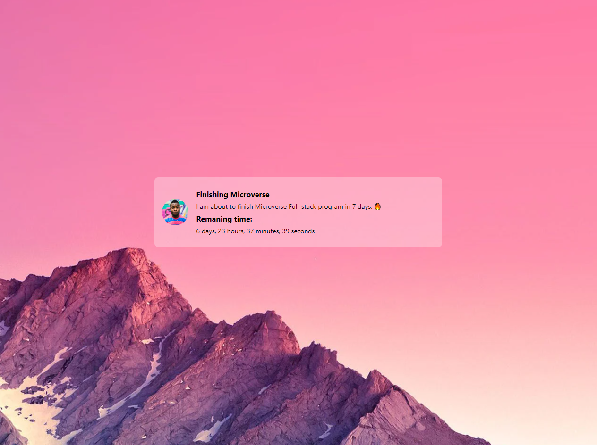

<a name="readme-top"></a>

<div align="center">

  <br/>

</div>


# 📗 Table of Contents

- [📗 Table of Contents](#table-of-contents)
  - [🛠 Built With ](#built-with)
    - [Key Features ](#key-features)
  - [🚀 Project Preview ](#preview)
  - [💻 Getting Started ](#getting-started)
    - [Prerequisites](#prerequisites)
    - [Setup](#setup)
    - [Install](#install)
    - [Usage](#usage)
    - [Run tests](#run-tests)
    - [Deployment](#deployment)
  - [👥 Authors ](#authors)
  - [🔭 Future Features ](#future-features)
  - [🤝 Contributing ](#contributing)
  - [⭐️ Show your support ](#️show-your-support)
  - [❓ FAQ ](#faq)
  - [📝 License ](#license)


# 📖 [Countdown Feature Rails] <a name="about-project"></a>

**Countdown Feature Rails** is a simple Rails feature that allows user to set his goals and countdown timer. W

## 🛠 Built With <a name="built-with">
- Rails


### Key Features <a name="key-features"></a>

> Key features of the application are

- **Landing page**
- **Countdown timer**
- **Countdown bio**


<p align="right">(<a href="#readme-top">back to top</a>)</p>


## 🚀 App Preview <a name="preview"></a>




<p align="right">(<a href="#readme-top">back to top</a>)</p>


### Prerequisites

In order to run this project you need:

- Ruby and Rails on you operating system eg. for  [Ubuntu 20.04](https://www.digitalocean.com/community/tutorials/how-to-install-ruby-on-rails-with-rbenv-on-ubuntu-20-04)
- React.js
- [Node.js](https://nodejs.dev/en/) installed
- [PostgreSQL](https://www.postgresql.org/) database installed

### Setup

Clone this repository to your desired folder:

```sh
  cd my-folder
  git clone https://github.com/edi-sipka/countdown_feature
```

### Install

Install this project with:

```sh
  cd countdown_feature

  bundle install
```
<p align="right">(<a href="#readme-top">back to top</a>)</p>


## 👥 Authors <a name="authors"></a>

👤 _Edi Sipka_

- GitHub: [@Edi-Sipka](https://github.com/edi-sipka)
- Twitter: [@sipka_edii](https://twitter.com/sipka_edii)
- LinkedIn: [Edi Sipka](https://www.linkedin.com/in/edi-%C5%A1ipka-5b681b202/)


<p align="right">(<a href="#readme-top">back to top</a>)</p>


## 🔭 Future Features <a name="future-features"></a>

- Set alarm.

<p align="right">(<a href="#readme-top">back to top</a>)</p>


## 🤝 Contributing <a name="contributing"></a>

Contributions, issues, and feature requests are welcome!

Feel free to check the [issues page](https://github.com/edi-sipka/countdown_feature/issues).

<p align="right">(<a href="#readme-top">back to top</a>)</p>


## ⭐️ Show your support <a name="support"></a>

If you like this project buy me [drink](.../.../)

<p align="right">(<a href="#readme-top">back to top</a>)</p>


## ❓ FAQ <a name="faq"></a>

- **How I can run this project?**

  - After cloning repository, run `bundle install` to install all gems. Then run rails s to run the project. 


<p align="right">(<a href="#readme-top">back to top</a>)</p>

<!-- LICENSE -->

## 📝 License <a name="license"></a>

This project is [MIT](./LICENSE) licensed.


<p align="right">(<a href="#readme-top">back to top</a>)</p>